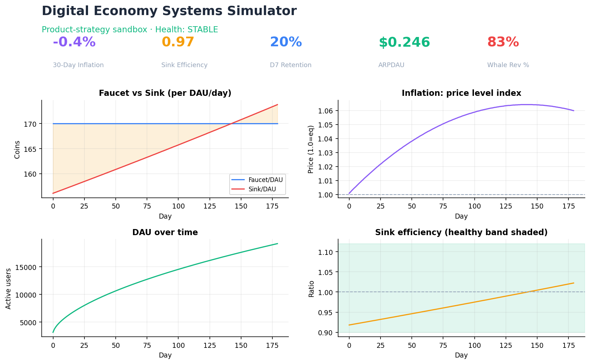
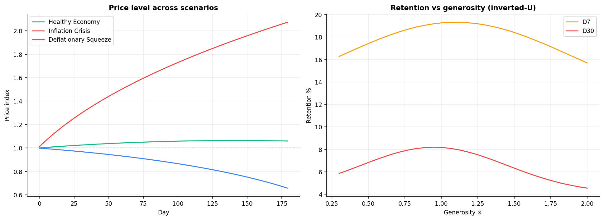
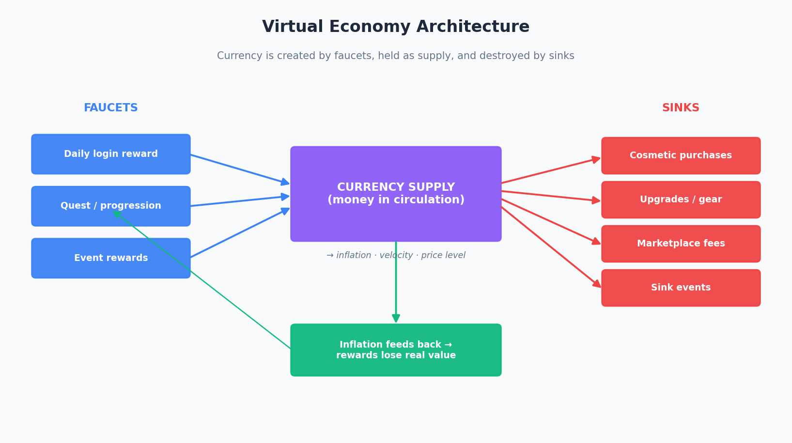
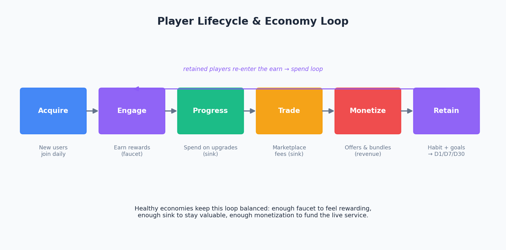

# 🪙 Digital Economy Systems Simulator

**A product-strategy sandbox for digital economies.**
Demo Live Link: https://digital-economy-simulator.streamlit.app/


Pick a scenario or move the levers, and watch inflation, retention, marketplace
health, and revenue respond — with a live **Economy Health** status and a written
**Product Insights** panel explaining *why* the numbers move and which lever to pull.

This is **product strategy + analytics + systems design in one repo** — built to be
read by a product manager first and an engineer second.



---

## What makes it more than charts

- **🟢 / 🟠 / 🔴 Economy Health status** — an at-a-glance verdict (Stable /
  Inflation Risk / Economy Collapse) derived from sink efficiency, inflation
  thresholds, and DAU trend.
- **KPI card row** — the five numbers a PM puts on the wall: 30-day inflation,
  sink efficiency, D7 retention, ARPDAU, and marketplace velocity.
- **🧠 Product Insights panel** — written analysis, not just lines on a graph.
  > *"Inflation is rising (+6.1% / 30d). Faucets generate 160 coins/DAU/day against
  > only 60 in sinks — a 62% surplus that accumulates as excess supply. Marketplace
  > fees cover just 8% of total sink pressure, so they can't stabilise circulation
  > alone. Add direct sinks or trim rewards to close the gap."*
- **One-click scenario presets** — Healthy Economy, Whale-Driven, Inflation Crisis,
  Hyper-Generous Rewards, Sink Starvation, Deflationary Squeeze.



---

## Why this exists

Live-service products rarely fail on gameplay. They fail when the **economy**
quietly breaks:

- **Inflation** erodes the value of every reward until nothing feels worth earning.
- **Progression fatigue** sets in when players are over-rewarded and run out of goals.
- **Weak ownership** — currency and items that can't be traded never feel truly owned.
- **Monetization that borrows from the future** — events that spike revenue while
  debasing the currency players are paying for.

This project makes those failure modes **visible, tunable, and explained**.

> Many live-service products struggle with inflation, progression fatigue, and weak
> ownership incentives. This project explores how reward loops, sinks, and
> marketplace systems affect long-term engagement and monetization stability.

---

## Architecture

Currency is created by **faucets**, held as **supply**, and destroyed by **sinks**.
The balance drives inflation, which feeds back into the value of every reward.



The player lifecycle wraps around that economy as a loop — acquire, engage,
progress, trade, monetize, retain:



---

## Features

| # | Feature | What it answers |
| --- | --- | --- |
| 1 | **Faucet vs Sink balancing** | Is currency created faster than it's destroyed? How fast are we inflating? |
| 2 | **Retention impact modeling** | How do generosity, pacing, and frequency move D1/D7/D30? |
| 3 | **Marketplace simulation** | Are prices stable? Is the market liquid? How much currency do fees remove? |
| 4 | **Monetization metrics** | ARPDAU, payer conversion, whale contribution, sink-monetization efficiency |

### 1 · Faucet vs Sink
Daily rewards, quests, purchases, upgrades, marketplace fees, and event rewards
feed a **stable price model** (quantity-theory style) that produces realistic
inflation *and* deflation around an equilibrium — no runaway or collapse. Surfaces
inflation, currency velocity, and **sink efficiency**.

### 2 · Retention impact
Adjust reward generosity, progression pacing, and reward frequency. See simulated
**D1 / D7 / D30** retention and the DAU curve — including the **inverted-U** where
over-rewarding *hurts* long-term retention (progression fatigue).

### 3 · Marketplace economy
Player trading across rarity tiers (Common → Legendary) with supply/demand price
discovery, **price elasticity of demand** (so it settles at equilibrium),
transaction fees, and seasonal demand shifts. Tracks liquidity and volatility.

### 4 · Monetization
ARPDAU built from whale / dolphin / casual cohorts, **payer conversion**, **whale
revenue share**, and **sink-monetization efficiency** (does monetization protect or
debase the economy?). Test seasonal offers, premium bundles, and sink events, and
see ARPDAU lift *and* the inflation side effect side by side.

---

## Product metrics tracked

Currency circulation (velocity) · 30-day & annualised inflation · price level ·
D1/D7/D30 retention & DAU · marketplace velocity (transactions, liquidity,
volatility) · ARPDAU · payer conversion · whale contribution · sink efficiency.

---

## Quickstart

```bash
# 1. Clone
git clone https://github.com/<your-username>/digital-economy-simulator.git
cd digital-economy-simulator

# 2. (Optional) virtual environment
python -m venv .venv && source .venv/bin/activate   # Windows: .venv\Scripts\activate

# 3. Install dependencies
pip install -r requirements.txt

# 4. Run the dashboard
python -m streamlit run app/simulator.py
```

> **Windows tip:** if `streamlit` isn't recognised as a command, use
> `python -m streamlit run app/simulator.py` — it works even when the Scripts
> folder isn't on your PATH.

Then open the local URL Streamlit prints (usually `http://localhost:8501`).

### Use the models without Streamlit

```python
from app.economy_engine import EconomyConfig, EconomyEngine

eng = EconomyEngine(EconomyConfig(reward_generosity=1.5, cosmetic_spend=30))
history = eng.run(marketplace_volume_per_dau=120)
summary = EconomyEngine.health_summary(history)
status = EconomyEngine.classify_health(
    summary["avg_sink_efficiency"], summary["inflation_30d_pct"])
print(status)   # ('🔴', 'Economy Collapse', [reasons...])
```

---

## Repository structure

```
digital-economy-simulator/
├── README.md
├── requirements.txt
├── app/
│   ├── simulator.py            # Streamlit dashboard: presets, health, KPIs, insights, tabs
│   ├── economy_engine.py       # Faucet/sink, stable price model, health classifier
│   ├── retention_model.py      # D1/D7/D30 (inverted-U) + DAU curve
│   ├── marketplace_model.py    # Supply/demand, elasticity, fees, rarity
│   ├── monetization_model.py   # ARPDAU, conversion, whale share, sink-monetization eff.
│   ├── scenarios.py            # Presets + Product Insights engine
│   ├── _make_diagrams.py       # Regenerates docs/ architecture PNGs
│   └── _make_screenshots.py    # Regenerates screenshots/ from live data
├── data/
│   └── sample_metrics.csv      # Example simulation output
├── docs/
│   ├── economy_architecture.png
│   ├── lifecycle_flow.png
│   ├── product_decisions.md    # Why sinks matter, why inflation kills engagement, …
│   └── monetization_strategy.md
└── screenshots/
    ├── dashboard.png
    └── economy_chart.png
```

---

## How the model works (in one paragraph)

The economy is a stock-and-flow system: `supply(t+1) = supply(t) + faucets - sinks`.
The price level follows a stable, quantity-theory-style relationship —
`price = (supply / equilibrium) ** elasticity` — which gives a genuine equilibrium
(price 1.0), smooth inflation when supply grows, smooth deflation when it shrinks,
and no numerical blow-ups. Retention is modelled as an **inverted-U** against
generosity (too stingy → early churn; too generous → progression fatigue), with
frequency driving early habit. The marketplace runs supply/demand price discovery
per rarity tier with price elasticity of demand so it settles at equilibrium, and
its fees feed back into the economy as a real sink. Monetization blends whale /
dolphin / casual cohorts into ARPDAU and links back to economy health via
sink-monetization efficiency. Full reasoning:
[`docs/product_decisions.md`](docs/product_decisions.md).

---

## Positioning

Not "a simulation tool" — a **product strategy sandbox for digital economies**. The
value isn't precise forecasting; it's the ability to *reason about tradeoffs*:
faucet/sink balance, inflation vs reward value, generosity vs long-term retention,
and revenue vs economy health. The models are deliberately simple and transparent so
cause and effect stay legible.

---

## Tech stack

Python · Streamlit · Pandas · NumPy · Matplotlib

## Further reading

- 📄 [Product decisions](docs/product_decisions.md) — the reasoning behind the model.
- 📄 [Monetization strategy](docs/monetization_strategy.md) — ARPDAU, whales, event playbook.
